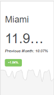
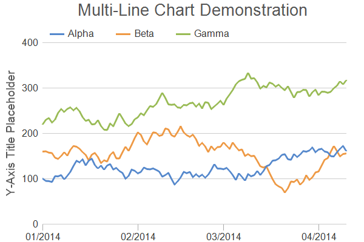
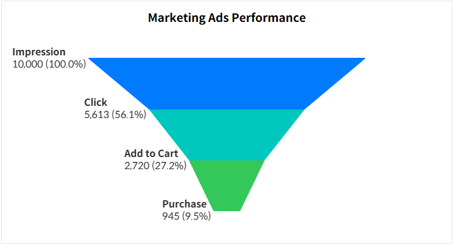

# 🖥️ React Project

## 1. 프로젝트 개요 및 목표 📊

### 개요

쇼핑몰 데이터 분석 도구 제작

사용자 행동 로그 데이터를 기반으로 한 분석 대시보드를 React로 구현해본다.

사용자의 페이지 방문, 클릭, 구매 등의 행동 데이터를 기준으로 필터링, 집계, 시각화를 수행하며 데이터 흐름 중심의 SPA 구조를 설계한다.

이를 통해 다양한 대시보드를 구현하면서 대시보드 UI 구현 경험 쌓도록 한다.

### 목표 🎯

이는 React의 역량을 기르기위한 프로젝트로 다양한 리액트 훅을 활용해보며 리액트 역량을 강화시키는데에 집중 되어있다.

데이터는 json-server를 활용해서 조회하고 분석 및 가공하여 시각적으로 표현한다.

단, 이 프로젝트는 SPA 프로젝트이므로 데이터를 생성하고 저장하는데 제약이 있을 수 있다.

이를 통해 데이터 흐름 설계 능력을 향상 시키고 

- useReducer(함수 기반 상태 관리)
- Context(전역 상태 전달)
- useMemo(불필요한 재연산 방지)
- Custom Hook(재사용 가능한 로직 분리)

와 같은 다양한 리액트 훅을 활용하는 역량을 기르도록 한다.

### 최종 결과물 🧩

완성 시 아래 화면들이 동작하는 React SPA:

3개의 페이지

- Overview 대시보드 — 시간 흐름에 따른 데이터 변화
- 사용자 분석 페이지 — 유저별 행동 패턴, 재방문율
- 이벤트 분석 페이지 — 클릭구매 이벤트 집계 및 테이블

필터 패널 — 날짜 범위, 이벤트 타입, 사용자 그룹으로 나눠서 필터

### 성공 기준(KPI) 📌

- 기능
    - 필터 동작 : 선택한 조건에 따라 차트 및 테이블 즉시 반영
    - 차트 : 3종 이상 차트 타입 정상 구현
    - API 연동 : json-server 활용
- React
    - useReducer : 필터 상태를 reducer로 관리
    - Context : 전역 필터 상태를 2개 이상 컴포넌트에서 구독
    - useMemo : 집계 연산에 메모이제이션 적용
- 6월 17일까지 핵심 기능 배포 완료

## 2. 상세 기능 명세서 (기능 목록) 🧾

1. 사이드 바 Sidebar
    - 날짜 범위 필터 📅
        - 시작일, 종료일 범위 선택
    - 이벤트 타입 필터 🔘
        - 체크 박스 여러개 선택 가능
        - page_view / click / purchase
    - 어떤 유저 그룹만 볼지 선택 👥
        - 신규 유저
        - 재방문 유저

2. 대시 보드 Overview 📈  
KPI 카드 :  

    - 하루 사용자 수
        - KPI 카드로 전날 대비 변화율을 나타낸다.

    - 한달 사용자 수
        - 이번달 1~오늘
        - 지난달 1~같은 날짜 비교
        - KPI로 비교해서 차이를 확인함
    - 총 이벤트 수
        - 단순 수치로 나타냄
    - 전환율 <구매 / 방문>
        - 전월 동일 기간 대비 전환율
        - KPI 카드로 나타냄
차트 : 
    - 이벤트 트렌드(멀티 라인 차트)
    - 전환 퍼널
    - 상위 페이지 TOP5
3. 사용자 분석 페이지 Users
    - 신규 / 재방문 유저 비율
        - 신규는 일주일 전까지
        - 도넛 차트
    - 재방문율 테이블
        - 주별

    - 상위 페이지 차트 📉
        - 방문 수 기준 정렬
        - 상위 10만 표시
        - 바 차트

4. 이벤트 트렌드 차트 📊 Event

- 스택 바
    - 시간별 이벤트 발생량 차트
    - 이벤트 타입별(VIEW / CLICK / PURCHASE)  


- 이벤트 분포  퍼널 차트 🥧
    - VIEW > CLICK > PURCHASE를 통해
- 데이터 원본 리스트 📄
    - 이벤트 로그 나열
    - 필터 적용된 결과만 보여줌
    - 페이지 나눔

5. 쇼핑몰 페이지 (데이터 수집용)
    - 회원가입/로그인
        - 로그인 성공하면 개발자 화면과 다른 화면으로 이동
    - 쇼핑 리스트
    - 상세보기 페이지
6. 로딩 / 에러 상태 ⚠️
7. 필터 초기화 🔄
    - 모든 조건 리셋

UI 흐름 및 화면 전환

| **화면** | **라우트** | **주요 컴포넌트** |
| --- | --- | --- |
| Overview | / | 핵심 지표 카드(KpiCard) × 4 : 하루 사용자 수, 한달 사용자 수, 총 이벤트 수, 구매 전환율


| 구분         | 경로      | 구성                                                                                                                                                                                |
| ---------- | ------- | --------------------------------------------------------------------------------------------------------------------------------------------------------------------------------- |
| **대시보드**   | /       | **KpiCard × 4** (하루 사용자 수, 한달 사용자 수, 총 이벤트 수, 전환율)<br>**TrendLineChart** (이벤트 트렌드, 멀티 라인)<br>**FunnelChart** (VIEW → CLICK → PURCHASE 전환 흐름)<br>**TopPageBarChart** (상위 페이지 TOP5) |
| **사용자 분석** | /users  | **UserSegmentChart** (신규 / 재방문 비율)<br>**RetentionTable** (재방문율)<br>**TopUserList** (상위 사용자)                                                                                       |
| **이벤트 분석** | /events | **EventBarChart** (시간별 이벤트 발생량, 스택 또는 그룹 바)<br>**FunnelChart** (이벤트 분포 퍼널)<br>**EventDetailTable** (이벤트 로그)                                            |
| **공통 필터**  | Sidebar | **DateRangePicker** (날짜 범위)<br>**EventTypeFilter** (page_view / click / purchase)<br>**SegmentFilter** (신규 / 재방문)<br>**FilterResetButton**                                        |
| **쇼핑몰 페이지**  | /shop | **List(상품목록)** <br>**Detal** (방문 페이지, 상품 선택)|
## 페이지 별로 적용되는 필터 ⚙️

### `/` Overview

- 전역 필터 전부 사용

---

### `/users`

- 날짜 O
- 유저 그룹 O

---

### `/events`

- 날짜 O
- 이벤트 타입 O

---

### `/shop`

## 3. 사용자 시나리오 및 흐름도 🔄

### 시나리오 A — 신규 방문자가 오늘의 지표를 확인 

1. 사용자가 앱에 접속 → "/" 라우트에서 Overview 페이지 렌더링
2. json-server로 로그 데이터 GET 요청 (로딩 스켈레톤 표시)
3. 데이터 수신 완료 → KPI 카드 4개와 트렌드 차트 렌더링
4. 기본 필터: 오늘 날짜, 전체 이벤트 타입, 전체 사용자

출력: 총 이벤트 수 / 하루 방문자 수 / 구매 전환율 / 평균 세션 시간 카드

---

### 시나리오 B — 특정 기간의 구매 이벤트만 분석

1. 좌측 필터 패널에서 날짜 범위를 변경 (2025-05-01 ~ 2025-05-31)
2. 이벤트 타입 체크박스에서 "purchase"만 선택
3. filterReducer가 상태를 갱신 → useMemo가 필터된 데이터를 재계산
4. 모든 차트·테이블이 구매 이벤트만 표시되도록 자동으로 갱신
5. 이벤트 분석 페이지(/events)로 이동해 상세 로그 테이블 확인

출력: 구매 이벤트 건수, 상위 구매 페이지, 사용자 목록

---

### 시나리오 C — 재방문 사용자 행동 패턴 분석

1. 사용자 세그먼트 필터에서 "재방문"을 선택
2. 사용자 분석 페이지(/users)로 이동
3. 재방문 사용자의 평균 세션 수와 주요 방문 페이지 차트 확인
4. 상위 재방문 사용자 테이블에서 특정 사용자 ID 클릭
5. 해당 사용자 이벤트 로그만 필터링된 상세 뷰 확인

출력: 재방문율, 세션당 평균 이벤트 수, 이탈 페이지

---

| **앱 진입**
/ (Overview) | → | **필터 적용**
날짜 / 이벤트 / 세그먼트 | → | **결과 갱신**
차트·테이블 자동 반영 |
| --- | --- | --- | --- | --- |

네비게이션으로 페이지 이동 시 필터 상태는 유지된다.

## **4. 비즈니스 규칙 및 예외 처리** ⚠️

### 데이터 규칙

| **규칙** | **내용** |
| --- | --- |
| 이벤트 타입 | page_view / click / purchase 세 가지만 유효 |
| 날짜 형식 | ISO 8601 (YYYY-MM-DD), 범위 역전 불허 |
| 사용자 ID | 숫자형 고유값, null 허용 안 함 |
| 타임스탬프 | Unix ms 기준, 클라이언트에서 로컬 시간으로 변환 |
| 집계 단위 | 일별(day) 기본, 시간별(hour) 선택 가능 |

### 예외 처리 규칙

| **상황** | **처리 방식** |
| --- | --- |
| API 타임아웃 (5초 초과) | 에러 상태 전환 + "재시도" 버튼 노출 |
| 필터 결과 0건 | "해당 조건의 데이터가 없습니다" 빈 상태 UI |
| 날짜 범위 역전 | 선택 불가 혹은 선택 즉시 경고 토스트, 조회 차단 |
| 잘못된 라우트 접근 | 404 페이지 렌더링 + Overview로 리다이렉트 |
| json-server 미실행 | Network Error 안내 + 로컬 실행 방법 가이드 |

## 5. 컴포넌트 아키텍처 🧱

### **컴포넌트 3계층 구조**

1. Pages (라우트 단위) — /Overview, /Users, /Events
    
    각 페이지가 Container를 조합, 전역 Context를 구독
    
2. Containers (데이터 처리) — FilterPanel, ChartContainer, TableContainer
    
    useReducer·useMemo로 데이터 가공, UI 컴포넌트에 props 전달
    
3. UI Components (화면 표시) — KpiCard, LineChart, DataTable, Skeleton
    
    props만 받아 렌더링, 상태 없음 (or useState 최소화)
    

<aside>
🧭

**전역 상태 흐름** 🌐

```
FilterContext (Provider)  ─→  useReducer(filterReducer, initialState)
│
├─ dispatch(SET_DATE) ──── DateRangePicker
├─ dispatch(SET_EVENT_TYPE) ─ EventTypeFilter
└─ dispatch(RESET_FILTER) ── 초기화 버튼
```

- 각 Container는 useContext(FilterContext)로 현재 필터 구독
- useMemo(() => filterLogs(rawData, filter), [rawData, filter])
- → 필터 변경 시에만 재계산, 불필요한 렌더링 방지
</aside>